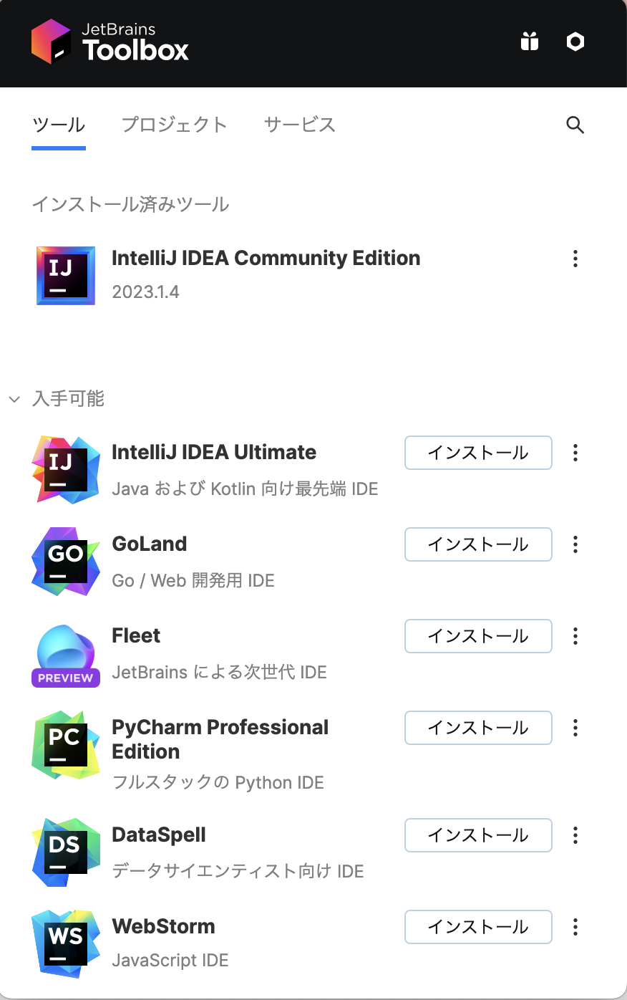
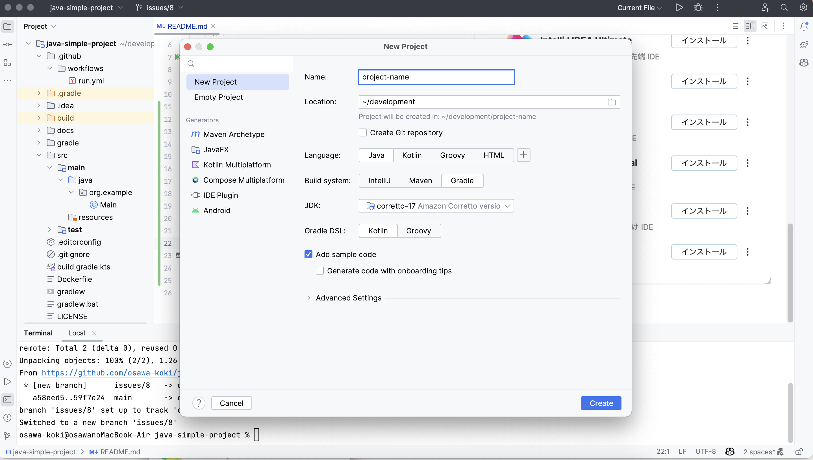

# java-simple-project

🫀🫀🫀 Javaでアプリケーションを開発してみるサンプルプロジェクト。  

## 実行方法

```shell
docker build -t java-simple-project .
docker run -it --rm --name java-simple-project java-simple-project
```

## 準備方法

### JetBrains Toolbox Appのインストール

[JetBrains Toolbox App](https://www.jetbrains.com/ja-jp/toolbox-app/)をインストールします。  
Javaの開発には、IntelliJ IDEAが使用されることが多く、これらのIDEをインストールするために使用します。

### IntelliJ IDEAのインストール

JetBrains Toolbox Appを使用して、IntelliJ IDEAをインストールします。  

  

### プロジェクトの初期化

プロジェクトを初期化します。  
  

ここでは、LanguageをJava、Build SystemをGradle、Java Versionを17(Amazon Corretto)に設定します。  
作成したら、右上の実行ボタンを押して、プロジェクトを実行します。  
